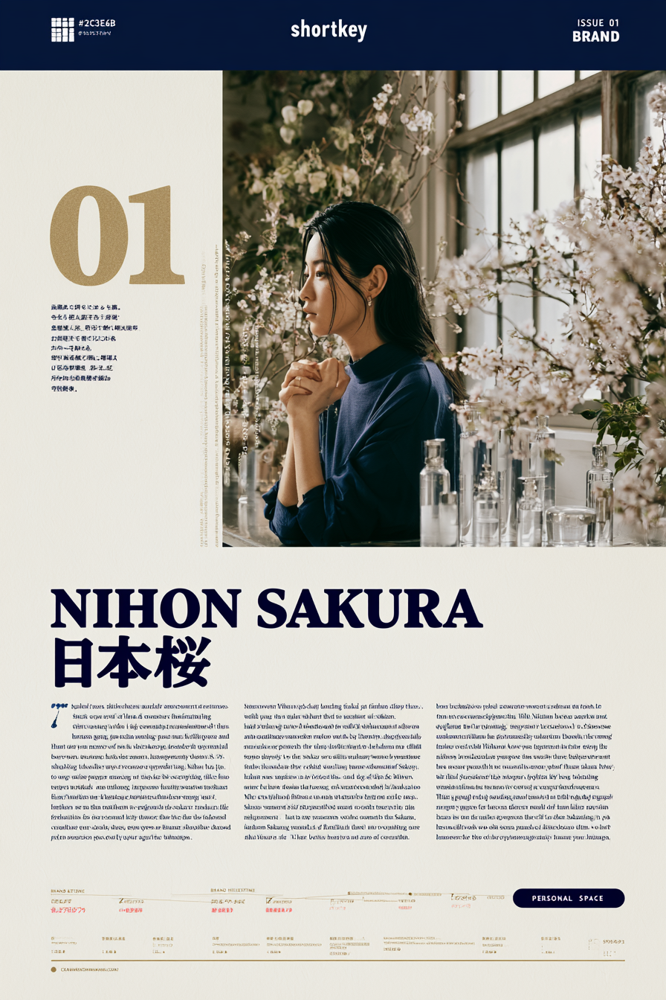
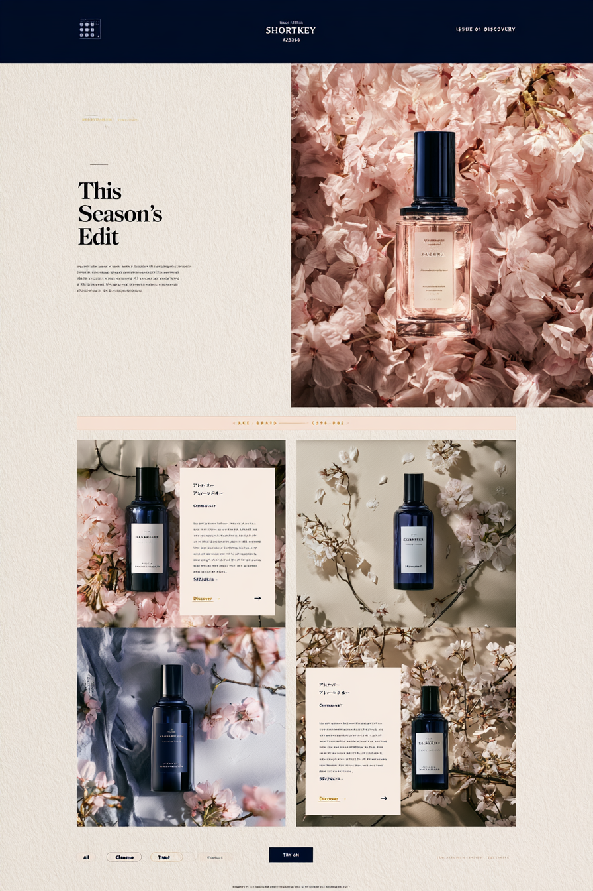
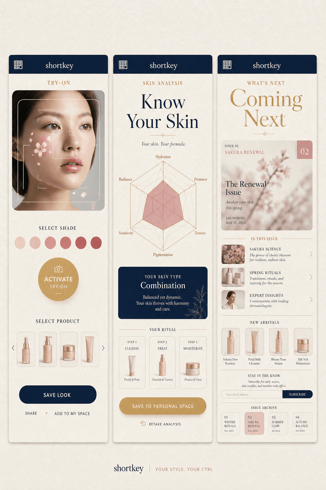
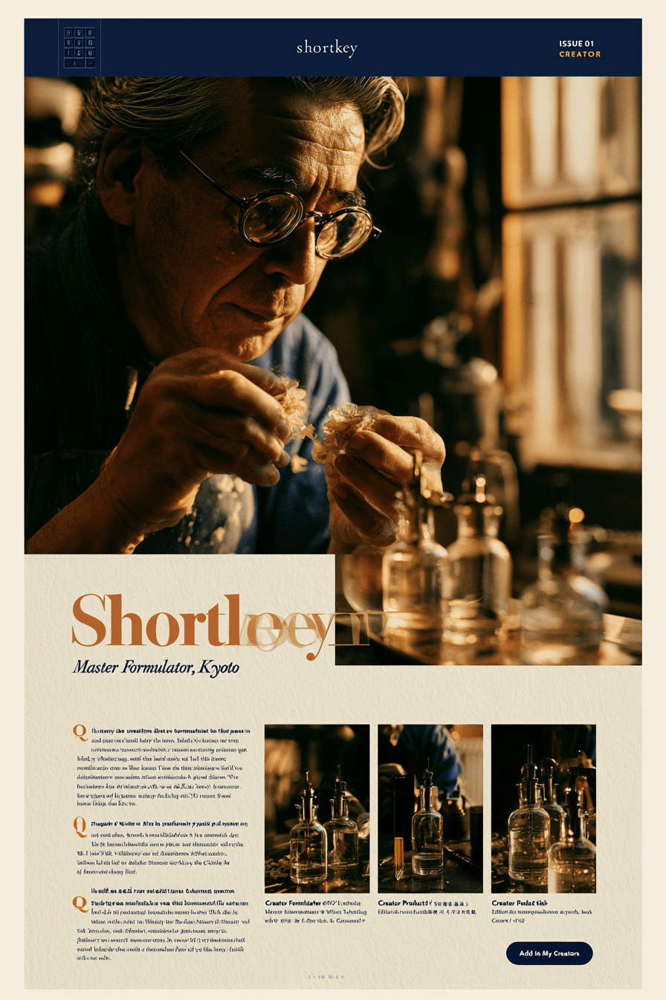
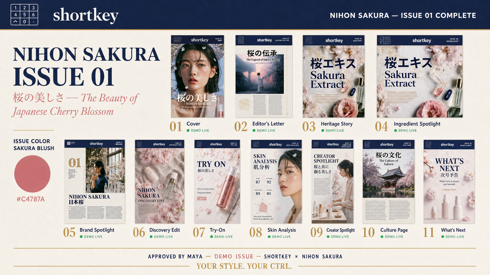
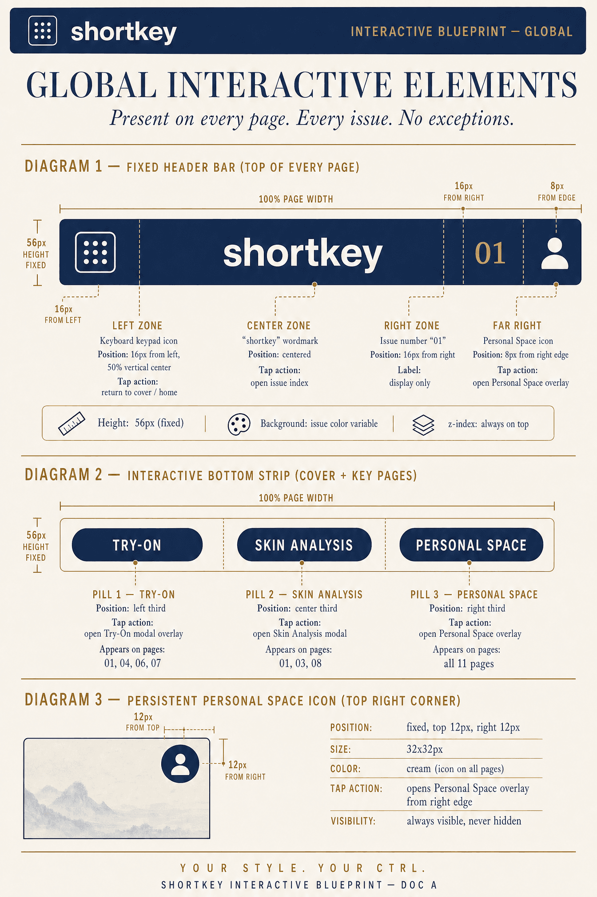
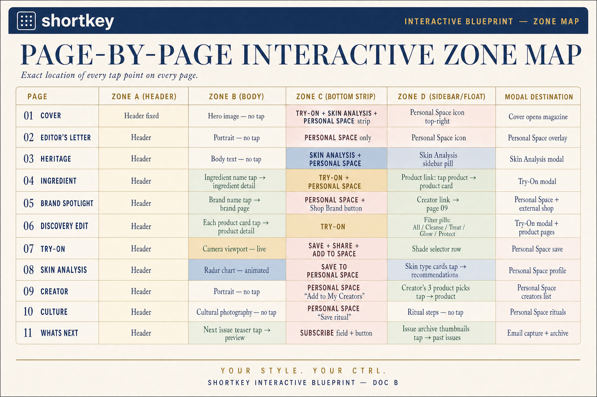
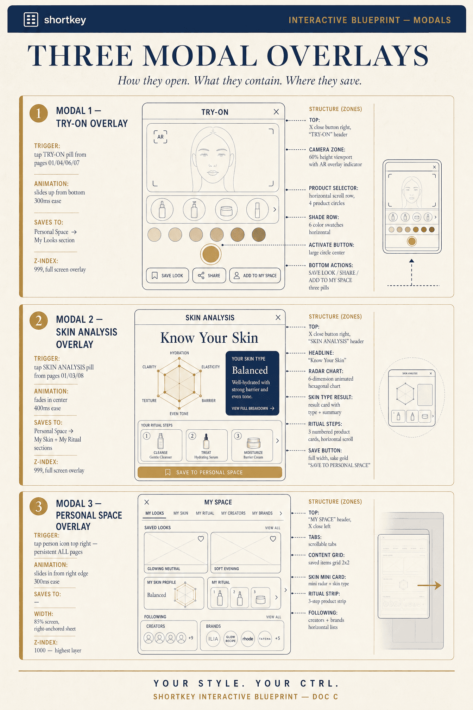
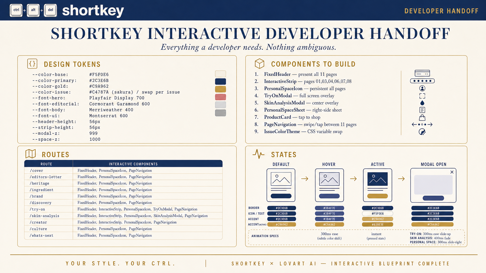

# Lovart · Issue 01

14 different files. Open **Markdown Preview** (`Ctrl+Shift+V`).

| Page | File |
|------|------|
| Cover | `cover.png` |
| Editor's Letter | `editors-letter.png` |
| Heritage | `heritage.png` |
| Ingredient | `ingredient.png` |
| Brand Spotlight | `brand.png` |
| Discovery Edit | `discovery.png` |
| Try-On + Skin + Next | `try-on-skin-next.png` |
| Creator | `creator.png` |
| Culture | `culture.png` |
| Overview | `overview.png` |
| Blueprint · Global Elements | `blueprint-global-elements.png` |
| Blueprint · Zone Map | `blueprint-zone-map.png` |
| Blueprint · Modal Overlays | `blueprint-modal-overlays.png` |
| Blueprint · Developer Handoff | `blueprint-developer-handoff.png` |

## Cover

## Editor's Letter

## Heritage

## Ingredient

## Brand Spotlight

## Discovery Edit

## Try-On + Skin + Next

## Creator

## Culture

## Overview

## Blueprint · Global Elements

## Blueprint · Zone Map

## Blueprint · Modal Overlays

## Blueprint · Developer Handoff

